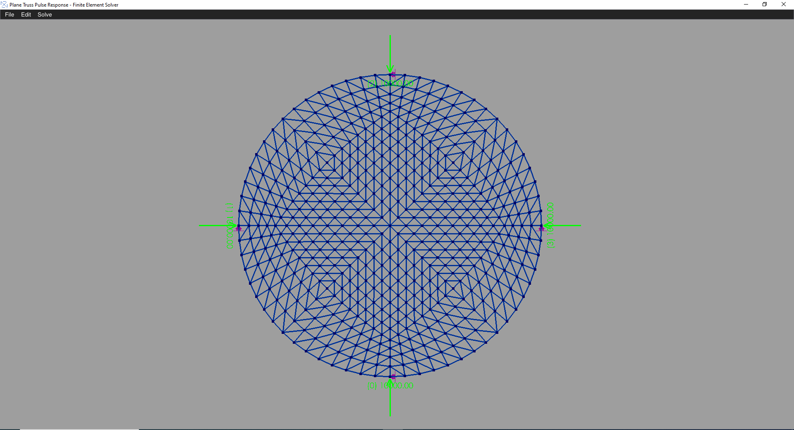

# Plane Truss Pulse Response Analysis and Visualization Tool

## Table of Contents

- [Introduction](#introduction)
- [Features](#features)
- [Installation](#installation)
- [Usage](#usage)
- [Analysis](#analysis)
- [Visualization](#visualization)
- [Example](#example)
- [Dependencies](#dependencies)
- [Contributing](#contributing)
- [License](#license)

## Introduction

The Plane Truss Analysis and Visualization Tool is a C++ application capable of importing plane truss models from varai2D, raw text files and AutoCAD DXF files. It facilitates various structural analysis tasks such as applying boundary conditions, adding point masses, applying initial conditions, and simulating dynamic responses to half sine pulse forces. The tool utilizes C++17 and OpenGL 3.3 for rendering the models and analysis results.

## Features

- Import plane truss models from varai2D, raw text files and AutoCAD DXF files.
- Apply boundary conditions to fix or release specific degrees of freedom with support inclination.
- Add point masses to the truss nodes.
- Apply initial conditions for dynamic analysis.
- Simulate dynamic responses using modal superposition.
- Visualize the pulse response of the truss model using OpenGL 3.3 batch rendering.

## Installation

1. Clone the repository: `git clone https://github.com/Samson-Mano/Plane_truss_pulse_response_simulation.git`
2. Navigate to the project directory: `cd Plane_truss_pulse_response_simulation`
3. Compile the project using your C++17 compiler: `g++ -std=c++17 -o Plane_truss_pulse_response_simulation main.cpp`
4. Run the compiled executable: `./Plane_truss_pulse_response_simulation`

## Usage

1. Prepare your truss model description in a text file or DXF format.
2. Run the executable and follow the on-screen instructions to import the model.
3. Apply boundary conditions, point masses, and initial conditions as needed.
4. Perform modal analysis to calculate mode shapes and natural frequencies.
5. Simulate the pulse response using modal superposition.
6. Visualize the results using the built-in OpenGL renderer.

## Analysis

The tool supports two main analysis modes:

1. **Modal Analysis**: Calculate mode shapes and natural frequencies of the truss model.
2. **Pulse Response Analysis**: Simulate the dynamic response of the truss to a half sine pulse force.

## Visualization

The visualization is powered by OpenGL 3.3. The tool offers batch rendering of the truss model and its dynamic response.

## Example

Here are some screenshots of the Plane Truss Analysis and Visualization Tool in action:

*Model view*

*Modal analysis*

*Pulse analysis*

## Dependencies

- C++17 Compiler
- OpenGL 3.3
- Third-party libraries (if any)

## Contributing

Contributions are welcome! If you find any issues or have suggestions for improvements, please open an issue or submit a pull request.

## License

This project is licensed under the MIT License - see the [LICENSE](LICENSE)
